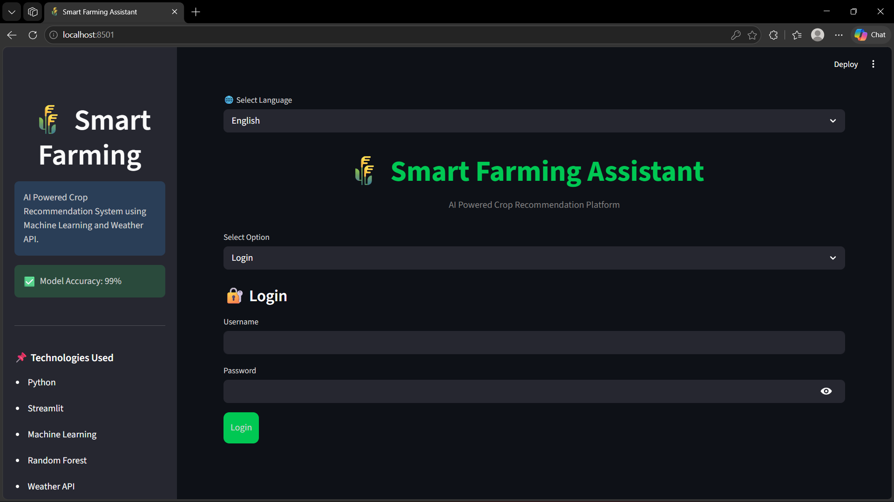
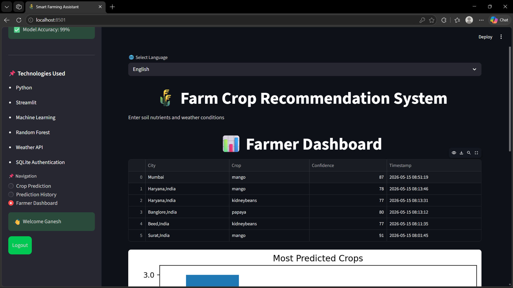
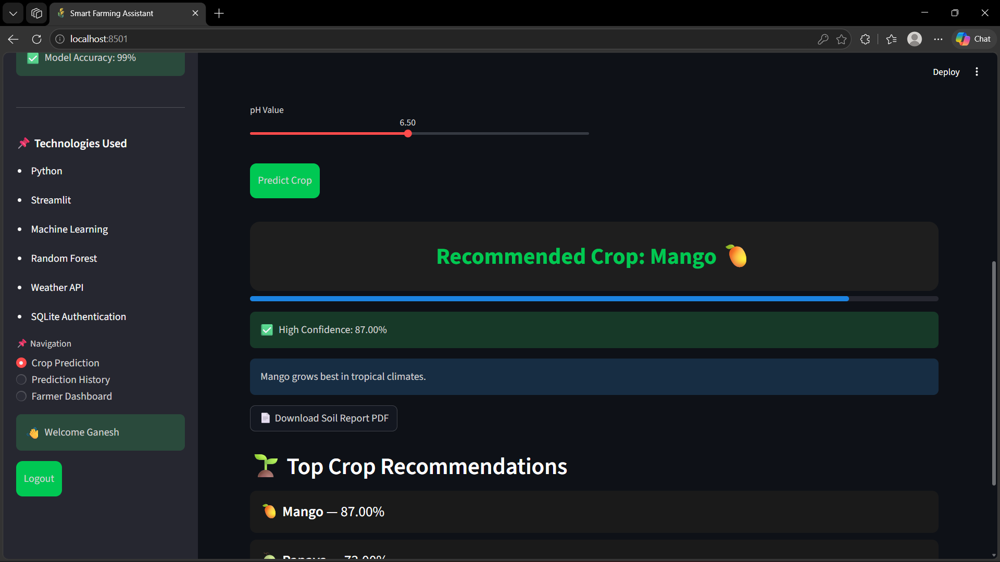
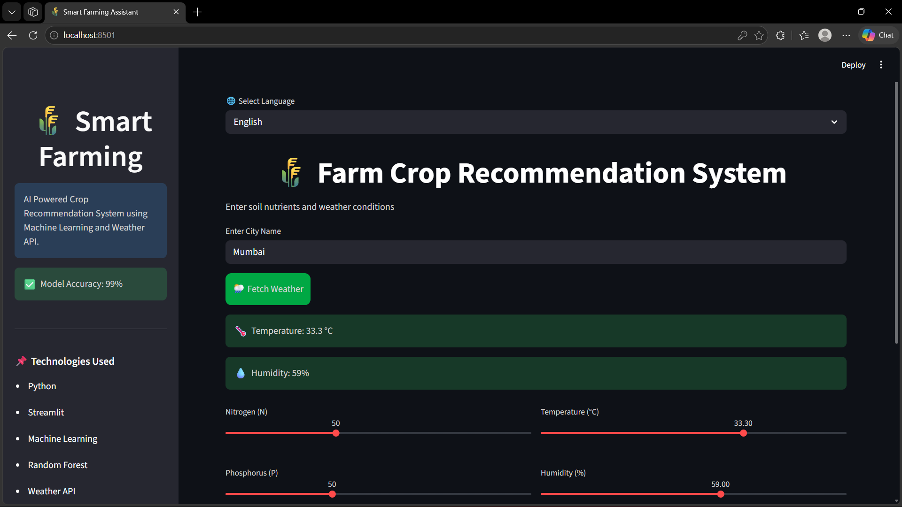
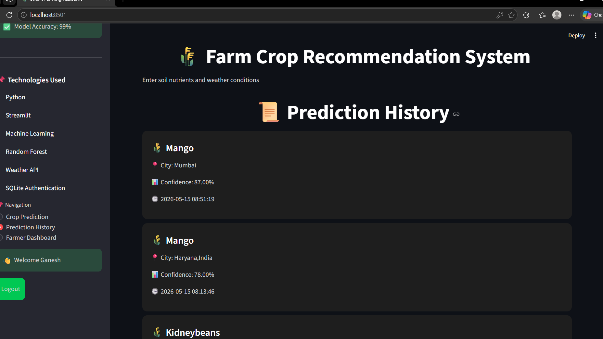

# 🌾 Smart Farming Assistant

An AI-powered Smart Farming Assistant built using Machine Learning, Streamlit, Weather API, and SQLite Authentication.

This application helps farmers predict the best crop based on:

- Soil nutrients
- Weather conditions
- Humidity
- Rainfall
- pH value

---

# 🚀 Features

✅ Crop Recommendation using Machine Learning  
✅ Random Forest Classifier  
✅ Real-Time Weather API Integration  
✅ Multilingual Support (English, Hindi, Marathi)  
✅ User Authentication System  
✅ Prediction History  
✅ Farmer Dashboard with Analytics  
✅ PDF Soil Report Generation  
✅ Beautiful Premium UI  
✅ SQLite Database Integration

---

# 🛠️ Technologies Used

- Python
- Streamlit
- Scikit-learn
- Pandas
- NumPy
- SQLite
- WeatherAPI
- ReportLab
- Matplotlib

---

# 📂 Project Structure

```bash
smart-farming-assistant/
│
├── app.py
├── auth.py
├── train_model.py
├── model.pkl
├── crop_recommendation.csv
├── requirements.txt
├── README.md
```

---

# ⚡ Installation

## 1️⃣ Clone Repository

```bash
git clone https://github.com/Ram9420/smart-farming-assistant.git
```

---

## 2️⃣ Move into Project Folder

```bash
cd smart-farming-assistant
```

---

## 3️⃣ Create Virtual Environment

```bash
python -m venv venv
```

---

## 4️⃣ Activate Virtual Environment

### Windows

```bash
venv\Scripts\activate
```

---

## 5️⃣ Install Dependencies

```bash
pip install -r requirements.txt
```

---

## 6️⃣ Run Streamlit App

```bash
streamlit run app.py
```

---

# 🌦️ Weather API Setup

1. Create account on WeatherAPI
2. Generate API Key
3. Replace your API key inside `app.py`

```python
API_KEY = "YOUR_API_KEY"
```

---

# Machine Learning Model

The crop prediction model is trained using:

- Random Forest Classifier
- Crop Recommendation Dataset

Input Features:

- Nitrogen (N)
- Phosphorus (P)
- Potassium (K)
- Temperature
- Humidity
- pH
- Rainfall

---

# 📸 Screenshots

## 🔐 Login Page



---

## 🌾 Farmer Dashboard



---

## 📊 Prediction Result



---

## 🌦️ Weather Integration




## Prediction History


---

# 🔮 Future Improvements

- AI Chatbot for Farmers
- Voice Assistant
- Fertilizer Recommendation
- Plant Disease Detection
- Government Scheme Recommendation
- Live Sensor Integration

---

# 👨‍💻 Developer

Ram Vilas Ingle

GitHub:
https://github.com/Ram9420

---

# ⭐ Support

If you like this project, give it a ⭐ on GitHub.
